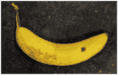

# Bananapedia
*No bananas were harmed in the making of this project!*

**Storing a banana through commas, howevers and parentheses!**

I'm tired of paying for storage, only to wrangle buckets and storage quotas. So I have stored a banana image, using nothing but unlimited public text edits and yellow noise *(no accounts to be seen!)*.

## How it works
To store the image of the banana, it is first heavily compressed and encoded into only a few thousand bits, through techniques like **Run-Length Encoding** and **Huffman Codes**.

The bitstream is then segmented into smaller chunks, ready to be stored through two altogether unconventional methods.

### 1: Wikipedia Storage
Wikipedia is widely known as an encyclopedia, with articles on just about everything. It is *not* widely known as a free distributed binary storage system. 

So that's _exactly_ what I used it as!

To do this, I devised an encoding system, where specific grammatical elements (e.g. Oxford commas, discourse markers, and parenthetical phrasing) map to `0`s and `1`s, in different locations across the bitstream.

I then made **over 200 edits** to Wikipedia, each carefully encoding a small chunk of the image. Each of these provided a unique edit ID, which can later be used to retrieve the edited sentence.

> INFO
> All edits to Wikipedia were constructive and useful, such as grammar fixes and clarity improvements.
> No vandalism occurred, and all edits were in line with the Wikipedia Terms of Use. 

### 2: Audio Storage (a.k.a Yellow noise)
You've probably heard of white noise, but have you heard of _yellow_ noise?

To conveniently store the Wikipedia edit IDs and necessary metadata (image width, colour palette, etc.), I encoded everything into a single, playable, `wav` file.

*(It is 100% not guaranteed to help you sleep!)*

https://github.com/user-attachments/assets/7b41f67f-c9e2-4be2-b4b0-7490e2e06c3c

## Decoding
To retrieve the banana:
1. Decode the WAV file, and recover the original JSON metadata.
2. Fetch each Wikipedia edit via the API (this is rather slow, due to rate limits)
3. Use some clever RegEx to locate the modified sentence.
4. Use (more) RegEx to check for various grammatical features, to reconstruct the bitstream
5. Reverse the image compression
6. *Voilà!* Enjoy gazing at the magnificent banana 🍌

All in all, it only loses a _tiny_ bit of resolution, and the banana is still clearly visible!

| Original                                               | Retrieved                                                       |
|--------------------------------------------------------|-----------------------------------------------------------------|
|  |  |

## AI Disclaimer
AI was used for assistance with:
- Researching compression techniques
- Wrangling RegEx queries
- Writing Wikipedia API requests

All design decisions, final code, and implementations are **human-written**.

## License
Bananapedia is licensed under the [MIT License](LICENSE). You are free to use, copy, modify and/or publish this project or parts of the code for commercial or non-commercial purposes. Acknowledgement is appreciated, but not required.

### Disclaimer

This project was designed as a one-off experiment, and is *not* intended to be practical, or used for permanent file storage. The author disclaims all liability for any loss of data resulting from the use or misuse of this project.

This project is not affiliated with, endorsed by, or sponsored by the Wikimedia
Foundation or Wikipedia.

The author does not condone the use of this project for activities that violate service terms, rate limits, or content usage policies. Users are solely responsible for ensuring their use complies with the
Wikimedia Foundation Terms of Use, API usage policies, and applicable laws.